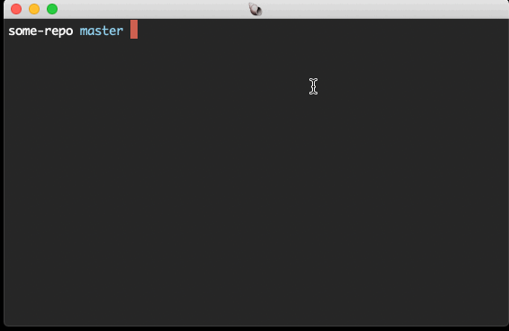

[](CODE_OF_CONDUCT.md)

# vim-fzf-coauthorship

A vim plugin built on top of [fzf.vim] to help insert [GitHub coauthorship attribution][attribution], e.g.:

```
Co-authored-by: Ru Paul <ru.paul@example.com>
```

It will look at people who have previously authored commits in the current repository and suggest them as co-authors.

[attribution]: https://help.github.com/en/articles/creating-a-commit-with-multiple-authors

## Demo



## Installation

Note: this plugin requires that you have installed [fzf.vim], as it is just a thin wrapper on top of that.

With [vim-plug]:

```vim
Plug 'maxjacobson/vim-fzf-coauthorship'
```

[vim-plug]: https://github.com/junegunn/vim-plug

## Usage

```
git add .
git commit -v
```

Now that you're in vim, just run `:Coauthorship` and hit enter to invoke the plugin.
Thereafter you can interactively search for other co-authors, and select one or more with `<TAB>` key-presses.

If you'd like to invoke it with `<C-g>` (control g), you can add this line to your vimrc:

```vim
nmap <silent> <C-g> :Coauthorship<CR>
```

[fzf.vim]: https://github.com/junegunn/fzf.vim
